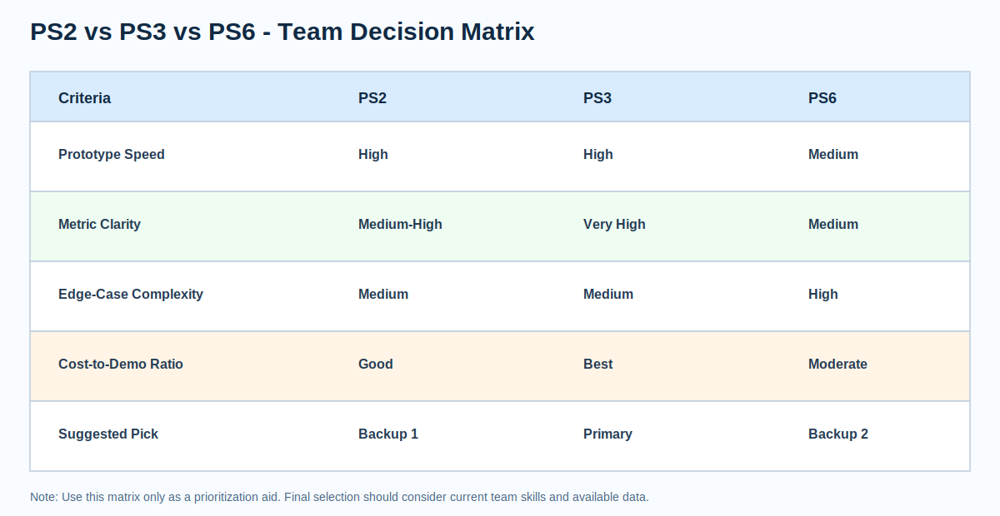
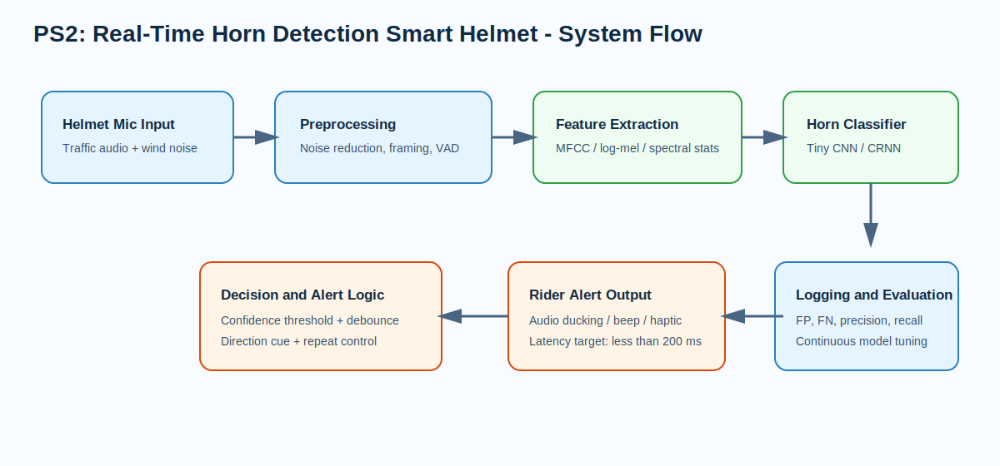
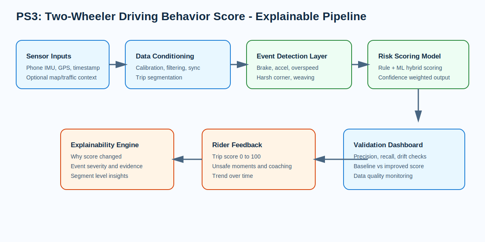
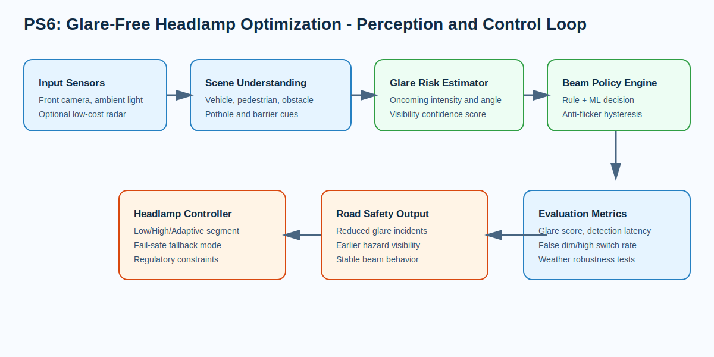

# Varroc Hackathon Team Playbook (PS2, PS3, PS6)

This repository document is written for group participation and sharing across teammates.
It provides deep analysis only for the three selected problem statements.

## Scope

Included:

- PS2: Real-Time Horn Detection in Smart Helmet
- PS3: Accurate Two-Wheeler Driving Behavior Score
- PS6: Headlamp Optimization for Glare and Poor Roads

Excluded:

- PS1, PS4, PS5, PS7, PS8, PS9

## How To Use This Document

For each statement, this playbook includes:

1. Problem intent and engineering context
2. Common existing solutions used today
3. Drawbacks observed in earlier solutions
4. Unsolved gaps and failure points
5. Improvements needed for a strong hackathon entry
6. Suggested proof-of-concept direction

## Team Decision Matrix

## PS2: Real-Time Horn Detection in Smart Helmet

### 1) Problem Intent

Helmet music and audio reduce situational awareness during riding. The system must detect external horn events and alert the rider in real time while avoiding nuisance alerts that can distract or annoy.

### 2) Existing Solutions

- Passive transparency and ambient hearing modes in premium headsets
- Loudness-threshold triggers based on simple dB cutoffs
- Keyword and event detection models trained on generic urban audio
- Mobile-app-based alerting using phone microphones
- Research prototypes using MFCC plus shallow classifiers

### 3) Drawbacks in Earlier Solutions

- Threshold methods confuse wind roar, exhaust, and horn harmonics
- Real roads have overlapping sources, causing frequent false positives
- Generic models fail when horn types vary by vehicle class and region
- Cloud dependency increases latency and fails in poor networks
- Alert spam causes alarm fatigue and rider rejection
- Most systems ignore direction relevance, so alerts are less actionable

### 4) Gaps

- Reliable horn discrimination under mixed traffic acoustics and reflections
- Robust performance across speed bands where wind noise is non-stationary
- On-device inference with low compute and low battery impact
- Consistent behavior across different helmet geometries and mic placements
- Explainable confidence reporting for each detection event

### 5) Improvements Needed

- Multi-stage audio pipeline: denoise -> voice activity and event gating -> feature extraction -> horn classifier
- Hybrid features (log-mel + temporal modulation + harmonic signatures)
- Confidence-aware alert policy with debounce, cooldown, and repeat suppression
- Direction estimation using dual-mic phase or intensity differences where available
- Personalized sensitivity presets for traffic density and rider preference
- Robustness validation on rainy, high-speed, and dense-traffic recordings

### 6) Strong Prototype Direction

- Build a curated dataset covering bike, auto, car, bus, and truck horn profiles
- Train a compact edge model and benchmark F1, false alerts per hour, and latency
- Demonstrate real-time alerts on recorded and live roadside audio
- Publish confusion matrix and hard-negative analysis for credibility

## PS3: Accurate Two-Wheeler Driving Behavior Score

### 1) Problem Intent

Convert riding dynamics into an objective, fair, and explainable safety score usable for training, safety programs, and insurance-linked use cases.

### 2) Existing Solutions

- Telematics scorecards based on speeding, braking, and acceleration events
- Smartphone trip scoring apps with limited sensor fusion
- Fleet behavior dashboards for logistics and ride-sharing operators
- Insurance telematics products with proprietary black-box scoring
- Rule-driven driving style tools used in rider training programs

### 3) Drawbacks in Earlier Solutions

- Opaque scoring logic reduces rider trust and acceptance
- Device placement variation introduces large feature drift
- Sensor drift and sampling jitter create false harsh-event detection
- Context blind scoring penalizes riders in heavy traffic or poor roads
- Pure rule systems lack adaptation, pure ML systems lack explainability
- Trip-level averages hide critical short-duration risky behavior

### 4) Gaps

- Event-level explainability with timestamped evidence clips
- Context-aware normalization by road quality, traffic density, and slope
- Balanced scoring that separates skill, risk exposure, and environment
- Real-time nudges plus post-ride coaching summaries
- Drift monitoring and periodic recalibration for long-term reliability

### 5) Improvements Needed

- Hybrid architecture combining physics constraints with ML risk estimation
- Event taxonomy with severity bands, confidence score, and persistence window
- Segment-level scoring to identify risky route segments and rider phases
- Calibration routine for mount orientation, sensor bias, and GPS quality
- Quality gates that suppress scoring when data quality drops below threshold
- Explainability layer describing exactly why score changed

### 6) Strong Prototype Direction

- Implement IMU and GPS ingestion with synchronized timestamps
- Build event detectors for braking, acceleration, cornering, overspeeding, and weaving
- Add context features from map speed limits and road roughness cues
- Deliver explainable scorecards with event timeline and actionable coaching
- Compare baseline rule-only model vs hybrid model with measurable lift

## PS6: Headlamp Optimization for Glare and Poor Roads

### 1) Problem Intent

Uncontrolled high-beam usage causes glare and accidents. The system should improve beam behavior while aiding earlier detection of potholes, pedestrians, barriers, and unexpected obstacles.

### 2) Existing Solutions

- Auto high-beam assist using camera or ambient light sensors
- Matrix and adaptive beam shaping in premium vehicles
- Static leveling systems and manual beam controls
- Vendor-specific ADAS-linked lighting controllers
- Reflector and lens optimization without dynamic intelligence

### 3) Drawbacks in Earlier Solutions

- Premium systems carry high BOM and integration cost
- Perception quality degrades in rain, fog, dust, and dirty lens conditions
- Frequent false dimming or delayed switching frustrates drivers
- Limited adaptation to non-lane roads and irregular infrastructure
- Sparse handling of potholes, barricades, and mixed traffic behavior
- Some systems flicker due to unstable frame-to-frame decisions

### 4) Gaps

- Adaptation to local road patterns, mixed traffic, and weak lane markings
- Low-cost perception and control stack that can run on constrained hardware
- Consistent behavior in adverse weather and low-contrast scenes
- Quantified glare-risk metric connected to beam decision logic
- Transparent fallback strategy when perception confidence is low

### 5) Improvements Needed

- Sensor fusion combining camera, brightness cues, and optional low-cost radar
- Rule-plus-ML beam policy with hysteresis and anti-flicker controls
- Confidence-gated fallback to safe low-beam profile under uncertainty
- Local dataset curation for potholes, barriers, glare sources, and pedestrians
- Edge-case testing suite for weather, road reflectivity, and curved roads
- Cost-optimized controller architecture for mass-market vehicles

### 6) Strong Prototype Direction

- Build a video-based inference prototype with beam-state overlay
- Define metrics: glare-risk index, obstacle detection latency, false switch rate
- Compare against baseline policies: always high-beam and static auto mode
- Show stability tests across day-night transitions and rain/fog clips
- Provide cost estimate and deployment path for production feasibility

## Selection Framework (Among PS2, PS3, PS6)

Use these criteria to select one final statement:

1. Feasibility within hackathon timeline
2. Ability to demonstrate measurable impact
3. Prototype clarity (live demo or simulation evidence)
4. Cost and scalability narrative
5. Team capability alignment

Suggested priority based on demo feasibility and measurable outcomes:

1. PS3
2. PS2
3. PS6

## What A Strong Submission Must Show

1. Baseline versus improved approach with numbers
2. Explicit treatment of earlier solution drawbacks
3. Clear gap-to-feature mapping
4. Risk register with mitigation actions
5. Practical deployment path and business potential

## Team Execution Plan (4 Weeks)

Week 1:

1. Finalize statement and objective metrics
2. Map existing solutions and failure cases
3. Freeze architecture and data/test plan

Week 2:

1. Build baseline model or mechanism
2. Implement first improved version
3. Capture initial benchmark results

Week 3:

1. Improve reliability on edge cases
2. Optimize latency/cost/power as relevant
3. Prepare demo script and visual evidence

Week 4:

1. Final validation and stress scenarios
2. Build final deck and technical report
3. Rehearse Q&A focused on drawbacks, gaps, and trade-offs

## Final Note

The winning pattern is not just a new idea. It is a defensible improvement over current solutions, backed by measurable results, realistic constraints, and a clear path to implementation.
